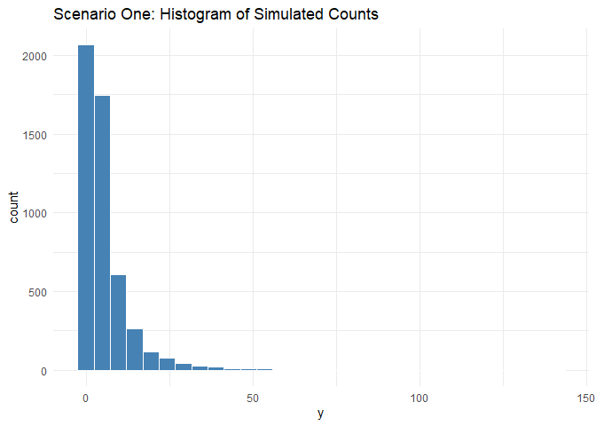
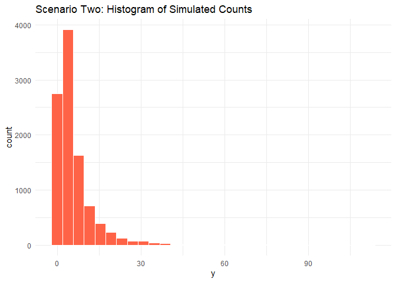

xflex4cast Package: Simulation and Model Fitting Examples
================
[](https://doi.org/10.5281/zenodo.16646225)

# Install and load `xflex4cast`:

``` r
# Install from source
devtools::install("path/to/xflex4cast")

# Load
library(xflex4cast)
```

# Overview

This document demonstrates core simulation experiments and model fitting
procedures for the `xflex4cast` package. We present a novel
probabilistic framework for forecasting fault counts that captures both
typical and extreme events. Non-extreme faults are modeled using a
smooth interpolation of multiple additive quantile regressions, while
extreme events are described through a discrete generalized Pareto (DGP)
distribution. The examples illustrated here correspond to the simulation
scenarios of the main manuscript.

## Scenario One: Constant Tail, Covariate in Bulk

### Simulate data

``` r
sim1 <- simulation_scenario_one(
  n = 5000,
  phi = 0.1,
  xi = 0.3
)

# View summary of simulated data
summary(sim1$data)
```

    ##   fit_data_row        x1                 x2                  y          
    ##  Min.   :   1   Min.   :-0.50000   Min.   :0.0000000   Min.   :  0.000  
    ##  1st Qu.:1251   1st Qu.:-0.11536   1st Qu.:0.0001611   1st Qu.:  1.000  
    ##  Median :2500   Median : 0.08693   Median :0.0007392   Median :  3.000  
    ##  Mean   :2500   Mean   : 0.12159   Mean   :0.0018226   Mean   :  5.742  
    ##  3rd Qu.:3750   3rd Qu.: 0.31050   3rd Qu.:0.0023735   3rd Qu.:  7.000  
    ##  Max.   :5000   Max.   : 1.66667   Max.   :0.0323828   Max.   :141.000

``` r
# Plot histogram of response variable y
ggplot(sim1$data, aes(x = y)) +
  geom_histogram(bins = 30, fill = "steelblue", color = "white") +
  theme_minimal() +
  ggtitle("Scenario One: Histogram of Simulated Counts")
```



### Define and Fit the xflex4cast Model

We define the model with formula linking response `y` to covariates `x1`
(true model specification) for the `mqgam` while keeping the scale
parameter of the tail model constant.

``` r
mqgam_formula <- y ~ s(x1,k=10)

model1 <- define_xflex4cast(
  mqgam_formula = mqgam_formula,
  mqgam_quantiles = c(0.05, 0.1, 0.25, 0.5, 0.75, 0.8,
                      0.9,0.95,0.99,0.999,0.9999),
  fit_tail = TRUE,
  scale_formula = ~ 1,
  quantile_threshold = 0.9,
  tail_distribution = "DGP"
)

fit1 <- fit(model1, sim1$data)

# Basic summary of tail model 
summary(fit1$tail_mod)
```

    ## 
    ## Distribution: Discrete Generalised Pareto
    ## 
    ## EQUATION 1
    ## Link function for mu: identity 
    ## Formula: exceedance ~ 1
    ## <environment: 0x0000017482ac10e0>
    ## 
    ## Parametric coefficients:
    ##             Estimate Std. Error z value Pr(>|z|)    
    ## (Intercept)  0.29875    0.06055   4.934 8.06e-07 ***
    ## ---
    ## Signif. codes:  0 '***' 0.001 '**' 0.01 '*' 0.05 '.' 0.1 ' ' 1
    ## 
    ## 
    ## EQUATION 2
    ## Link function for sigma: log 
    ## Formula: ~1
    ## <environment: 0x000001746a656700>
    ## 
    ## Parametric coefficients:
    ##             Estimate Std. Error z value Pr(>|z|)    
    ## (Intercept)  0.96390    0.07514   12.83   <2e-16 ***
    ## ---
    ## Signif. codes:  0 '***' 0.001 '**' 0.01 '*' 0.05 '.' 0.1 ' ' 1
    ## 
    ## mu = 0.299(0.178,0.42)  sigma = 2.62(2.28,3.03)
    ## n = 487  total edf = 2

### Inspecting Fitted Model Results

``` r
# Extract predicted quantiles for original data
predictions1 <- predict(fit1, sim1$data)
print(predictions1[index==1,])
```

    ##     index quantile      value
    ##     <int>    <num>      <num>
    ##  1:     1   0.0500  0.0000000
    ##  2:     1   0.1000  0.5664351
    ##  3:     1   0.2500  1.8242783
    ##  4:     1   0.5000  4.1723619
    ##  5:     1   0.7500  7.4331131
    ##  6:     1   0.8000  8.5387887
    ##  7:     1   0.9000 11.8174872
    ##  8:     1   0.9500 13.0000000
    ##  9:     1   0.9900 20.0000000
    ## 10:     1   0.9990 39.0000000
    ## 11:     1   0.9999 76.0000000

## Scenario Two: Tail Scale Varies with Covariates

### Simulate data

``` r
sim2 <- simulation_scenario_two(
  n = 10000,
  phi = 0.1,
  xi = 0.3
)

summary(sim2$data)
```

    ##   fit_data_row         x1                 x2                  y          
    ##  Min.   :    1   Min.   :-0.50000   Min.   :0.0000000   Min.   :  0.000  
    ##  1st Qu.: 2501   1st Qu.:-0.11506   1st Qu.:0.0001611   1st Qu.:  1.000  
    ##  Median : 5000   Median : 0.09492   Median :0.0007548   Median :  3.000  
    ##  Mean   : 5000   Mean   : 0.12763   Mean   :0.0018730   Mean   :  5.682  
    ##  3rd Qu.: 7500   3rd Qu.: 0.32513   3rd Qu.:0.0025427   3rd Qu.:  7.000  
    ##  Max.   :10000   Max.   : 1.66667   Max.   :0.0347027   Max.   :112.000

``` r
ggplot(sim2$data, aes(x = y)) +
  geom_histogram(bins = 30, fill = "tomato", color = "white") +
  theme_minimal() +
  ggtitle("Scenario Two: Histogram of Simulated Counts")
```



### Define and Fit the xflex4cast Model

We define the model with formula linking response `y` to covariates
`s(x1,k=5)` for the `mqgam` component and `~x2` to the tail component
only.

``` r
mqgam_formula2 <- y ~ s(x1,k=10) 

model2 <- define_xflex4cast(
  mqgam_formula = mqgam_formula2,
  mqgam_quantiles = c(0.05, 0.1, 0.25, 0.5, 0.75, 0.8 ,0.9,
                      0.95,0.99,0.999,0.9999),
  fit_tail = TRUE,
  scale_formula = ~ x2,
  quantile_threshold = 0.9,
  tail_distribution = "DGP"
)
```
